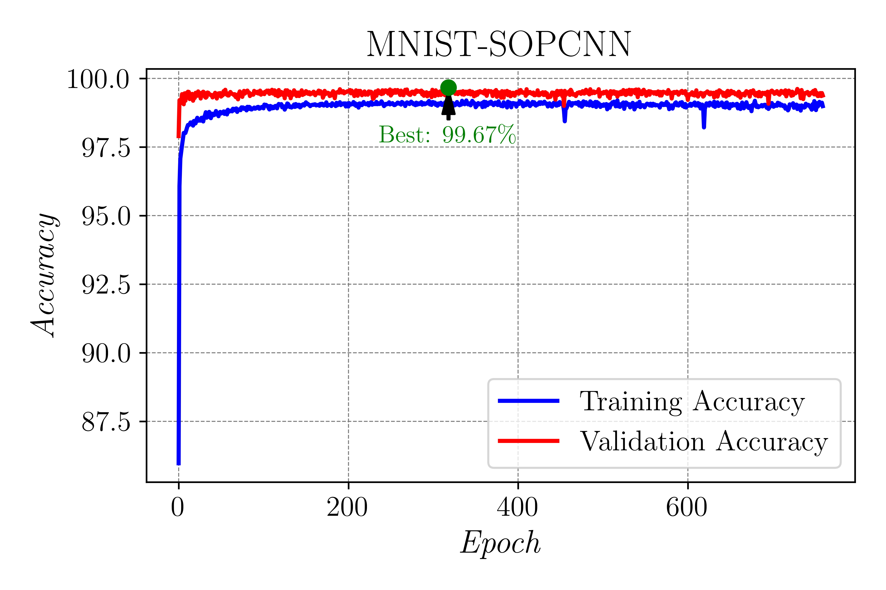

# MNIST-SOPCNN

This is my implementation of Stochastic Optimization of Plain Convolutional Neural Networks (SOPCNN) on the MNIST dataset.

## Description

This project implements a simple Convolutional Neural Network (CNN) model, named SOPCNN, for the MNIST dataset. The model follows the approach described in the paper "Stochastic Optimization of Plain Convolutional Neural Networks".

## Original Paper

- [Stochastic Optimization of Plain Convolutional Neural Networks](https://arxiv.org/pdf/2001.08856v1)

## MNIST Dataset

The MNIST dataset is a large database of handwritten digits that is commonly used for training various image processing systems. It is available at [this link](http://yann.lecun.com/exdb/mnist/).

## Experimental Setup

- **Batch Size**: 256
- **Learning Rate**: 0.001
- **Epochs**: 2000
- **Optimizer**: Adam
- **Model Name**: SOPCNN
- **Number of Classes**: 10
- **Data Path**: `./data`
- **Results Path**: `./results`
- **Model Save Path**: `./results/MNIST_SOPCNN.pth`
- **Log Interval**: 10
- **Patience**: 10
- **Min Delta**: 0.001
- **Device**: GPU if available, otherwise CPU

## Git Repository

This repository contains the implementation of the SOPCNN model for the MNIST dataset. It is structured as follows:

```
MNIST-SOPCNN/
│
├── config.py
├── data/
│   ├── dataset.py
├── models/
│   ├── model.py
├── train.py
├── test.py
├── utils/
│   ├── utils.py
│   ├── early_stopping.py
├── main.py
├── plot.py
└── results/
    ├── training_log.csv
    └── plots/
        ├── loss_plot.png
        └── accuracy_plot.png
```
## Model

The SOPCNN model is defined in `models/model.py`:

- **Convolutional Layers**: The model consists of four convolutional layers, with kernel sizes of 3x3 and padding of 1, progressively increasing the number of output channels from 32 to 256.
- **Activation Function**: ReLU (Rectified Linear Unit) activation functions are applied after each convolutional layer to introduce non-linearity.
- **Pooling Layers**: Max-pooling layers with 2x2 kernels and stride 2 are applied after every two convolutional layers to reduce spatial dimensions.
- **Fully Connected Layers**: The output from the convolutional and pooling layers is flattened and passed through two fully connected layers, with the first layer having 2048 units and the second layer outputting the final class predictions.
- **Dropout**: A dropout layer with a dropout rate of 0.8 is applied after the first fully connected layer to prevent overfitting and improve generalization.

```python
import torch.nn as nn
import torch.nn.functional as F

class SOPCNN(nn.Module):
    def __init__(self, num_classes=10):
        super(SOPCNN, self).__init__()
        self.conv1 = nn.Conv2d(1, 32, kernel_size=3, padding=1)
        self.conv2 = nn.Conv2d(32, 64, kernel_size=3, padding=1)
        self.conv3 = nn.Conv2d(64, 128, kernel_size=3, padding=1)
        self.conv4 = nn.Conv2d(128, 256, kernel_size=3, padding=1)
        self.pool = nn.MaxPool2d(kernel_size=2, stride=2)
        self.fc1 = nn.Linear(256 * 7 * 7, 2048)
        self.fc2 = nn.Linear(2048, num_classes)
        self.dropout = nn.Dropout(0.8)

    def forward(self, x):
        x = F.relu(self.conv1(x))
        x = F.relu(self.conv2(x))
        x = self.pool(x)
        x = F.relu(self.conv3(x))
        x = F.relu(self.conv4(x))
        x = self.pool(x)
        x = x.view(-1, 256 * 7 * 7)
        x = F.relu(self.fc1(x))
        x = self.dropout(x)
        x = self.fc2(x)
        return x
```

## Usage

1. **Clone the repository**:
   ```bash
   git clone git@github.com:junaidaliop/MNIST-SOPCNN.git
   ```

2. **Navigate to the project directory**:
   ```bash
   cd MNIST-SOPCNN
   ```

3. **Create and activate the conda environment**:
   ```bash
   conda env create -f SOPCNN.yml
   conda activate SOPCNN
   ```

4. **Run the training script**:
   ```bash
   python main.py
   ```

5. **Generate the plots**:
   ```bash
   python plot.py
   ```

## Future Work

One can extend this experiment to other datasets such as CIFAR10, CIFAR100, and SVHN.

## 🚀 **Update – May 29, 2025**

🎉 I’ve **achieved SOTA** results (matching the paper) using **SGD + Lookahead**!

📦 **SOTA Weights Available**:
Download them here 👉 [📁 Google Drive Link](https://drive.google.com/drive/folders/18SIYqa6mh4c4Lns-GhYBLs4F83O-w2LC?usp=sharing)

---

## 📊 **Results Summary**

|    Optimizer          |    LR  | 🏆 Best Test Accuracy |
| --------------------- | ------ | --------------------- |
| **⚡ SGD + Lookahead** | `0.01` | **🔥 99.78% 🔥**      |

Previously, the same model achieved a validation accuracy of 99.67% using Adam optimizer, which is slightly less than the experiments mentioned in the original paper. Below is the accuracy plot for that experiment:



## Contact Details

For any questions or issues, please email muhammadjunaidaliasifraja@gmail.com or create an issue in this repository.

## License

This project is licensed under the MIT License.

